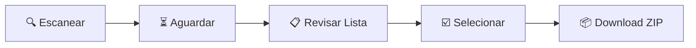

# 📖 Guia de Uso - Export Articles

> **Ferramenta acadêmica para download automático de arquivos web**  
> Este guia apresenta exemplos práticos e melhores práticas para usar a ferramenta.

---

## 🧪 Sites para Teste

Experimente a ferramenta com estes tipos de sites:

| Tipo | URL de Exemplo | Arquivos | Profundidade |
|------|----------------|-----------|--------------|
| 🎓 **Sites Acadêmicos** | `https://example.edu/papers` | PDF, DOC | 1 nível |
| 📚 **Repositórios** | `https://example.org/documents` | PDF, TXT, ZIP | Página atual |
| 🏛️ **Bibliotecas Digitais** | `https://library.example.com/resources` | PDF, DOC, XLS | 2 níveis |

---

## 🚀 Passo a Passo

### 📝 **Passo 1: Inserir URL**
```
💡 Exemplo: https://example.com/documents
```

### ⚙️ **Passo 2: Configurar Filtros**

| Tipo | Recomendação | Uso |
|------|--------------|-----|
| ✅ **PDF** | Sempre ativo | Artigos científicos, relatórios |
| ✅ **DOC/DOCX** | Para textos | Documentos de texto |
| ✅ **XLS/XLSX** | Para dados | Planilhas e datasets |
| ⚠️ **Imagens** | Só se necessário | Economiza espaço |
| ⚠️ **ZIP** | Com cuidado | Pode ser pesado |

### 🔍 **Passo 3: Definir Profundidade**

```
📄 Página atual    → Sites simples com arquivos listados
🔗 1 nível         → Sites com categorias/subpáginas  
🕸️ 2 níveis        → Estruturas complexas (cuidado!)
```

### ▶️ **Passo 4: Executar e Baixar**



1. **Clique em "Escanear"** - Inicia a busca automática
2. **Aguarde** - Pode levar alguns segundos
3. **Revise** - Lista de arquivos encontrados
4. **Selecione** - Marque os arquivos desejados  
5. **Download** - Receba o arquivo ZIP compactado

---

## 💡 Dicas e Boas Práticas

### ✅ **Recomendações**

| 🎯 **Dica** | 📋 **Descrição** |
|-------------|------------------|
| 🧪 **Teste primeiro** | Use URLs simples para validar |
| 🎛️ **Seja específico** | Use filtros para evitar downloads desnecessários |
| ⚖️ **Verifique direitos** | Respeite termos de uso e copyright |
| 📏 **Controle profundidade** | Sites grandes = profundidade baixa |

### ⚠️ **Limitações Conhecidas**

<details>
<summary><strong>🚫 Bloqueios e Restrições</strong></summary>

- **Sites com proteção anti-bot** - Podem bloquear automaticamente
- **Sites com autenticação** - Login necessário não funciona
- **Links JavaScript** - Conteúdo dinâmico pode não ser detectado
- **Arquivos muito grandes** - Limite de 100MB por arquivo

</details>

<details>
<summary><strong>🔧 Solução de Problemas</strong></summary>

| ❌ **Problema** | ✅ **Solução** |
|-----------------|----------------|
| Nenhum arquivo encontrado | Verifique URL e se arquivos são públicos |
| Download falha | Teste conexão de internet |
| Site não responde | Verifique se há proteção anti-bot |
| Erro de timeout | Reduza profundidade ou tente mais tarde |

</details>

---

## 🧪 Sites de Teste Seguros

> **⚠️ Importante**: Use apenas sites que permitem scraping automático

### 🔗 **URLs de Teste**

```bash
# Sites básicos para teste
http://httpbin.org/        # Ferramenta de teste HTTP
http://example.com/        # Site de exemplo padrão  

# Sites educacionais (com moderação)
https://pt.wikipedia.org/  # Wikipedia - use com cuidado
```

### 🎯 **Estratégia de Teste**

1. **Comece simples** - Use `example.com` primeiro
2. **Teste filtros** - Experimente diferentes tipos de arquivo
3. **Verifique profundidade** - Compare resultados entre níveis
4. **Valide downloads** - Confirme se arquivos estão corretos

---

## 🎓 Casos de Uso Acadêmicos

### 📚 **Pesquisa Bibliográfica**

<table>
<tr>
<td width="50%">

**🔍 Cenários Típicos:**
- Coletar PDFs de conferência
- Download de papers institucionais  
- Obter artigos de biblioteca digital

</td>
<td width="50%">

**⚙️ Configuração Sugerida:**
- ✅ PDF, DOC
- ❌ Imagens, ZIP
- 📊 Profundidade: 1-2 níveis

</td>
</tr>
</table>

### 📊 **Coleta de Dados**

<table>
<tr>
<td width="50%">

**📈 Tipos de Arquivo:**
- Planilhas de dados públicos
- Relatórios governamentais
- Documentos oficiais

</td>
<td width="50%">

**⚙️ Configuração Sugerida:**
- ✅ XLS, PDF, TXT
- ❌ Imagens
- 📊 Profundidade: 1 nível

</td>
</tr>
</table>

### 🗃️ **Arquivo de Recursos**

<table>
<tr>
<td width="50%">

**📝 Organização:**
- Backup de materiais de curso
- Biblioteca pessoal de documentos
- Arquivo de recursos de pesquisa

</td>
<td width="50%">

**⚙️ Configuração Sugerida:**
- ✅ Todos os tipos
- 📊 Profundidade: 2 níveis
- ⚠️ Monitorar tamanho total

</td>
</tr>
</table>

---

## 🛡️ **Considerações Éticas e Legais**

> **⚖️ Lembre-se sempre**: Respeite direitos autorais e termos de uso

### 📜 **Diretrizes**

| ✅ **Permitido** | ❌ **Evitar** |
|------------------|---------------|
| Documentos públicos | Conteúdo protegido por copyright |
| Dados governamentais abertos | Sites que proíbem scraping |
| Repositórios acadêmicos abertos | Conteúdo comercial protegido |
| Material educacional livre | Downloads em massa comerciais |

### 🤝 **Boas Práticas Éticas**

- **Cite as fontes** quando usar os arquivos
- **Respeite os limits** de download dos sites  
- **Use para fins acadêmicos** preferencialmente
- **Verifique licenças** antes de redistribuir

---

## 📞 **Suporte e Comunidade**

<div align="center">

**🚀 Desenvolvido para facilitar a pesquisa acadêmica**

| 📖 Documentação | 🐛 Reportar Bug | 💡 Sugerir Melhoria |
|-----------------|-----------------|---------------------|
| Leia o [README.md](README.md) | Abra uma issue | Contribua no projeto |

</div>

---

<div align="center">
<sub>Export Articles © 2025 - Ferramenta Acadêmica Open Source</sub>
</div>
